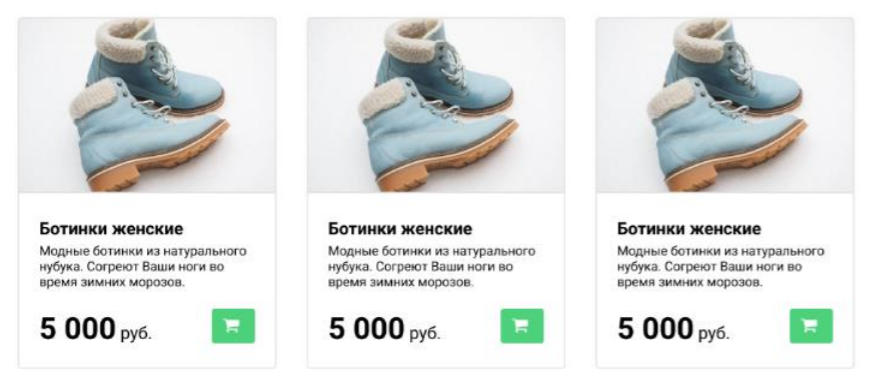
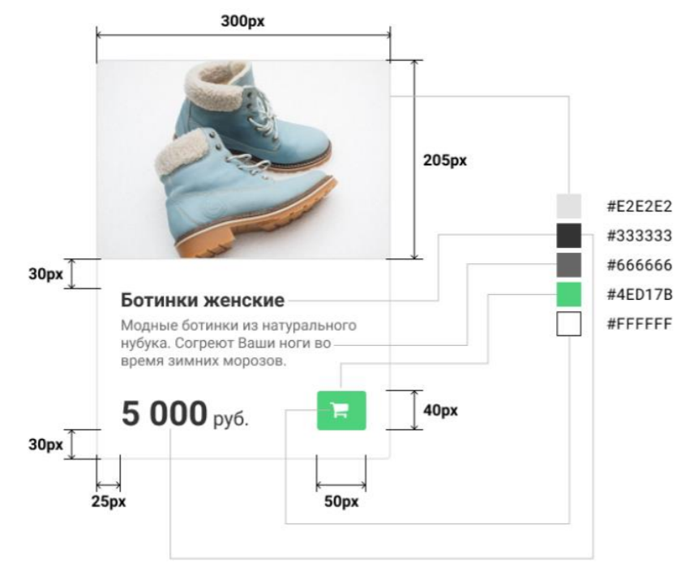

Решение можно посмотреть по ссылке
https://sanicdogg.github.io/kodland-task/

## Тестовое задание для преподавателя

### 2019

## Задание 2.

### Практическая часть

Сверстайте следующий шаблон:

### Фото ботинок - https://drive.google.com/open?id=1hIDXnFuVNTBkZacFUAVwe8aAbkSU21fo

Основными критериями являются визуальное сходство и актуальность используемых
приемов. На изображении ниже приведены параметры карточки. Полное соблюдение
параметров необязательно.

### Параметры текста :

- Используемый шрифт: Roboto
- Размер заголовка и подписи “руб.”: 20px
- Размер основного текста: 15px
- Размер цены: 35px

Удачи!

https://www.kodland.org/
